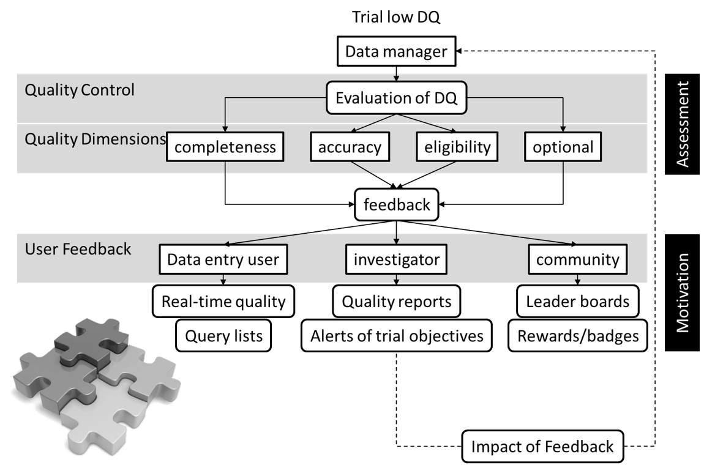
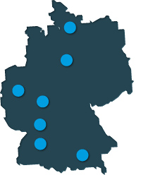

class: inverse, center, middle

# Outline

<h2>1. Feedback of Data Quality</h2> 

<h2>2. TxCohort</h2>

<h2>3. developed Dashboard framework</h2>

<h2>4. What next?</h2>

---

# 1. Feedback of Data Quality
Evaluation of Data Quality 

---

# 1. Feedback of Data Quality
Data Quality Feedback

---

# 1. Feedback of Data Quality
Interactivity needed?

* in some way, complex/high dimensional data has to be visualized

* __busy__ clinicans/investigator need all information on the __first look__

* on demand: __filtering__, __selecting__, __zooming__ 

* dynamic, simple, accessible --> __web-based & real-time applications__

---
class: dzif

# 2. TxCohort
### Transplantation Cohort - an Infrastructure of the German Center for Infection Control (DZIF)

* multicenter study with ~600 participants (all ages)

* participants after transplation of heart, lung, pancreas, kidneys, liver or stem cells

* __primary aim__: organ transplantation and its influence on  infection susceptibility and organ function

* 14 heterogene patient records (demography, postoperative procedures,   bacterial infections, etc.)

* monthly exports with in separate csv files   (5 centers x 6 organs x 14 records)

---

# 2. TxCohort - Data Processes
 

---

# Sometimes you have to run before you can walk.
 
<iframe width="560" height="315" src="https://www.youtube.com/embed/ZwOxM0-byvc" frameborder="0" allow="autoplay; encrypted-media" allowfullscreen></iframe>

---

# 3. TxDashboard

### Needs Assessment 

* Study Nurses, Clinicans, (Local-) Investigators

* content: 
    + Study Population / Recruitment Rate
    + Biosamples
    + Follow-up Performance
    + Data Quality
    
* common scripting language researcher and clinican (can) understand:
    + __language__: `R`
    + __documentation__: `rmarkdown`
    + __graphs__: `ggplot2`, `googleVis`, `leaflet`, `plotly`
    + __tables__: `knitr`, `kableExtra`, `DT`
    
* single page, quick to understand

---

# 3. TxDashboard

Demonstration

---

# 4. What's next?

* Extension of data quality assessment (more dimensions & indicators in regards to user needs)

* implementation of gamified features (leaderboards, awards, badges)

* measuring user interaction (user research)

* extension to `angular.js`/`shiny` frameworks (more flexibility)

---

class: last-slide, center, middle

# Thank you

---